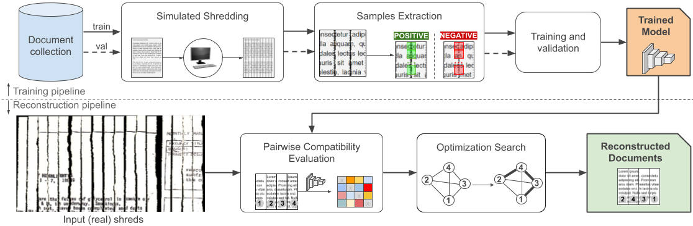
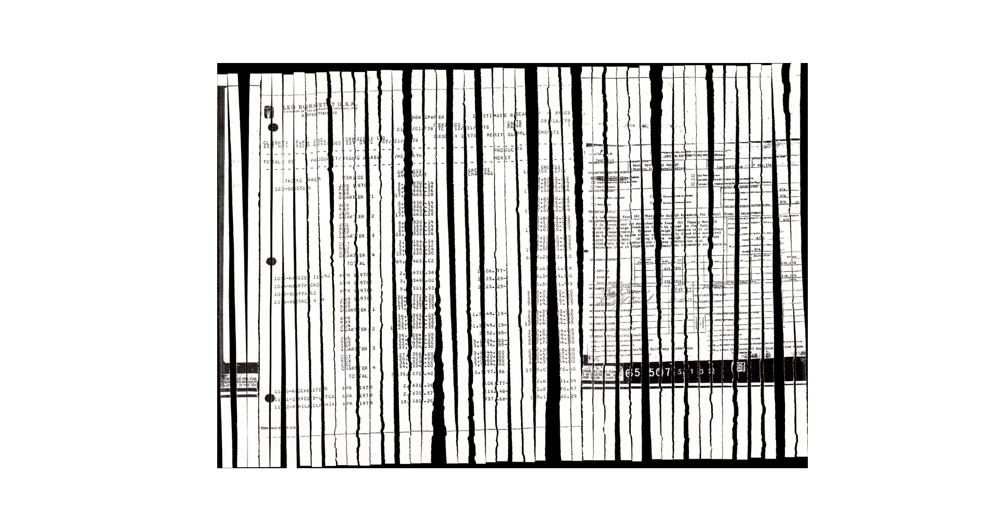

### Self-supervised deep reconstruction of mixed strip-shredded text documents

This repository comprises datasets and source codes used in our [Pattern Recognition (2020) paper](https://www.sciencedirect.com/science/article/pii/S0031320320303381).

#### Preparing the enviroment with virtualenv
Main dependencies:

* python==3.6
* tensorflow-gpu==1.11.0
* scikit-image==0.14.0
* scikit-learn==0.23.1
* opencv-python==3.3.1.11
* numba==0.51.2

For a fully-automatic setup of the virtual environment (tested on Linux Ubuntu 18.04), set the variable `BASE_DIR` in `scripts/install.sh` to a valid directory, and then run `source scripts/install.sh` from within the repository root directory. `BASE_DIR` indicates where additional directories (`envs`, `concorde`, `qsopt`) will be created.

You should have sudo privileges to run properly the installation script.
By default, the virtual environment will be created at `$BASE_DIR/envs/deeprec-pr20`. When finishing, the script will automatically activate the just created environment.

#### Download the datasets

The datasets include the (i) integral documents where the training (small) samples are extracted and (ii) the mechanically-shredded documents collections S-MARQUES (D1), S-ISRI-OCR (D2), and S-CDIP (D3) used in the tests. To download them, just run `bash scripts/get_dataset.sh`.

It will create a directory `datasets` in the repository root directory.

#### Download the results

You can download the results by running `bash scripts/get_results.sh`.

It will create a directory `results` in the repository root directory with three subdirectories (one for each experiment).

#### Demo

A reconstruction demo is available by running `python demo.py`. By default, the script uses a pretrained model available in the `traindata` directory. Here is an example of output of the demo script:

 For details of the parameters, you may run `python demo.py --help`.

<!-- #### Reproducing the experiments
To ease replicability, we created bash scripts with the commands used in each experiment. You can just run `bash scripts/experiment<ID>.sh` replacing `<ID>` by 1, 2, or 3. As described in the paper, each id corresponds to:

* 1: single-reconstruction experiment
* 2: multi-reconstruction experiment
* 3: sensitivity analysis

Results are stored as `.json` files containing, among other things, the solution, the initial permutation of the shreds, accuracy, and times. The files generated by the experiments 1 and 3 are at `results/proposed` and `results/sib18`, while those generated by the experiment 2 are at `results/proposed_multi` and `results/sib18_multi`. Results can be visualized through the scripts in the `charts` directory`. -->
